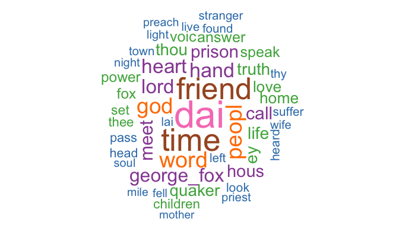
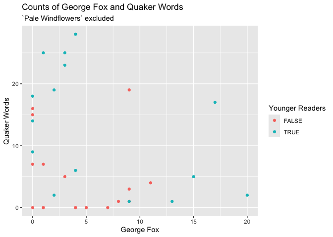
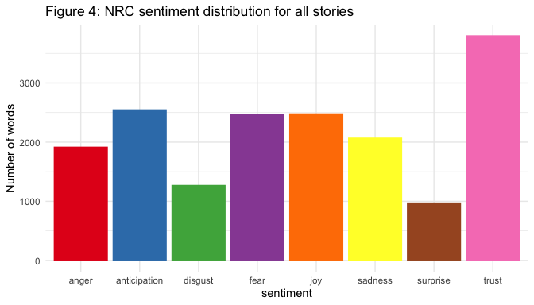
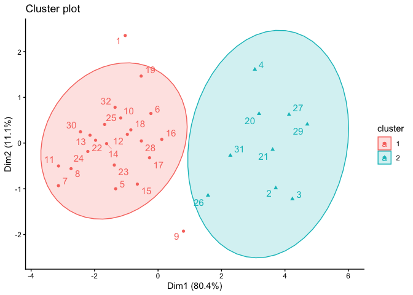
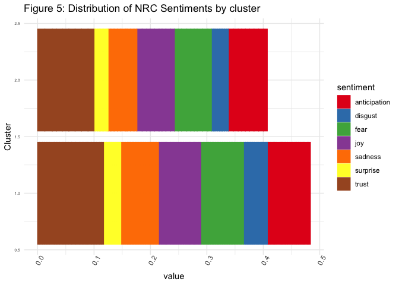

# Introduction

The Religious Society of Friends (Quakers) is a Protestant denomination
that was founded in England in the 1640s by George Fox. Some of the key
features of the religion are its commitment to the idea of that of God
in all, pacifism and simplicity. In the United States they are
associated with abolitionism.

J.V. Hodgkin was the daughter of a prominent Quaker family in England.
She wrote a number of books on Quaker topics. The most famous (still in
print today) is *A Book of Quaker Saints* (1917). The book contains a
series of historical stories, mainly about individuals who she describes
as “early Quaker saints.” In addition, there stories of events involving
multiple people, such as “Fierce Feathers” and “Children of Reading
Meeting.” These stories are well-known and widely retold among Quakers.

What do these stories tell us about Quaker attitudes?  
Can computational text analysis give us any insights?

## Objectives

1.  To identify common elements across the stories.
2.  Ways in which the stories labelled as appropriate for children might
    differ from the other stories.
3.  To describe how these relate to Quaker ideas.

# Methods

To analyze these questions, the entire text was obtaied from Project
Gutenburg. Following initial processing it was tokenized to individual
words and these were stemmed using the Porter 2 Snowball algorithm. For
common names the separate names were made into a single token, for
example “george fox” became “george_fox”. In cases where the same person
was referred to by different names (such as “etienne de grellet” being
recoded to “stephen_grellet”)

The original book includes extensive front matter, back matter and 32
stories. Each story also included an epigraph. For this analysis only
the main story texts were included.

Additional cleaning specifically related to this text included adding a
customized set of stop words (for archaic Quaker usage such are thou,
thee, thine and hast).

# Results

The most common words in the text are shown in Figure 1.

*Figure 1 Word Cloud*

George Fox appears frequently as do the words God and Lord, but other
terms are also more ordinary, although perhaps what might be expected in
stories, such as time, day and people. The word friend is common; in
this context this has two potential meanings: Quakers are also called
Friends and the ordinary meaning of a person someone is friends with,
which might be common in stories for children.

# George Fox and Quaker words

Although Quaker words is concentrated in a few stories. In particular
“Pale Windflowers” uses 118 of them. The story is about the important
early Quaker leader William Dewsbury and his grand daughter. Most of the
Quaker words are part of dialogues between them or with her mother or
aunt.

The limitation that using “george_fox” rather that “fox” means that the
presence of mentions of Fox may be undercounted

Overall, there is a general negative relationship between the frequency
of george_fox and the use of Quaker words. The stories for younger
readers often have many uses of either, but it seems to be an
alternative. That is, there are not any that have many uses of both
terms.

# Sentiment Analysis

Sentiment analysis provides a way to interpret the words used in a body
of text. It uses standard lexicons to characterize individual words
used.

## The NRC lexicon

The NRC lexicon assigns descriptive terms to words; some words are
assigned multiple labels. In the book as a whole, “trust” was the most
frequently assigned sentiment. Anticipation, fear and joy formed the
second highest group. This approach gives a richer understanding of the
content.

The distribution of these terms indicates that it is particular stories
that have many words reflecting the NRC sentiments. (X-squared = 711.75,
df = 203, p-value \< 2.2e-16) There are important differences between
the two groups of stories. The stories appropriate for children have
more labelled words overall. A Chi-squared test of independence leads to
rejection of the null hypothesis that the two variables are independent.
The children’s stories are much more likely to have the emotions of
fear, joy and trust than the other stories. (X-squared = 20.885, df = 7,
p-value = 0.003944)

# Clustering the stories

Overall, however, the differences between the clusters are not primarily
about the sentiments expressed, but are in the extent to which any
sentiment is expressed. Cluster 2 expresses *more* sentiments than
Cluster 1, regardless of what the sentiment is.

| cluster | N of Stories | Quaker Words | George Fox | For Younger |
|--------:|-------------:|-------------:|-----------:|------------:|
|       1 |           23 |           18 |         17 |           9 |
|       2 |            9 |            8 |          8 |           7 |

Characteristics of Stories in Clusters

The stories in cluster 2 have a much higher proportion of use of
george_fox and Quaker words and are more likely to be for younger
readers.

# Next Steps

The next step of this research will be to analyze the epigraphs
associated with each story. The similarities and differences with the
text of the stories will be explored.

Other collections of Quaker stories that are not always presented as
stories of saints and may be from different time periods will be
analyzed and compared to the *Quaker Saints*.

# Conclusion

Quantitative analysis of the text provides a distinctive way of
analyzing the Quaker stories. This analysis may also give us insights
into the kinds of stories that might have been thought of as appropriate
for children of different ages. In 1935 a collection *The Children’s
Story Caravan* and in 1962 an abridged version *Friendly Story Caravan*
with just 18 stories published. A 1990 edition contained just 18
stories. Many of the same incidents and people are included in these
later works, but some are excluded. Overall the idea of what kind of
stories would be most appropriate for children seemed to change
dramatically over those 80 years. This may reflect societal change in
ideas about children.

Frost (1971) discussed the Quaker practice of treating children as
“little adults” and its theological basis. Although his focus was on an
earlier period, this may be reflected in the creation of a book that is
not specifically for children. However, Hodgkin’s designation of some
stories as more suitable for children under age 9 may reflect some mixed
feelings about this in the early twentieth century. Compton’s work,
which is much more recent, describes one child recalling being very
upset about one particular story and

<figure>

<figcaption aria-hidden="true">Illustration of the Fierce Feathers
Story</figcaption>
</figure>

# Selected References

Crompton, Margaret. n.d. “Spiritual Equality in the Experience of Quaker
Children.”

Frost, Jerry W. 1971. “As The Twig Is Bent: Quaker Ideas of Childhood.”
Quaker History 60(2):67–87.

Hodgkin, L. V. (Lucy Violet). 1917. “A Book of Quaker Saints.”
<Https://Www.Gutenberg.Org/Files/19605/19605-h/19605-h.Htm>. Retrieved
May 14, 2024

Selected Packages used  

Fellows, Ian. 2018. *Wordcloud: Word Clouds*.
<http://blog.fellstat.com/?cat=11>.

Robinson, David, and Julia Silge. 2025. *Tidytext: Text Mining Using
Dplyr, Ggplot2, and Other Tidy Tools*.
<https://juliasilge.github.io/tidytext/>.

Silge, Julia, and David Robinson. 2016. “Tidytext: Text Mining and
Analysis Using Tidy Data Principles in r.” *JOSS* 1 (3).
<https://doi.org/10.21105/joss.00037>.

Thorne, Brent. 2026. *Posterdown: Generate PDF Conference Posters Using
r Markdown*. <https://github.com/brentthorne/posterdown>.

Wickham, Hadley. 2016. *Ggplot2: Elegant Graphics for Data Analysis*.
Springer-Verlag New York. <https://ggplot2.tidyverse.org>.

Wickham, Hadley, Winston Chang, Lionel Henry, Thomas Lin Pedersen,
Kohske Takahashi, Claus Wilke, Kara Woo, Hiroaki Yutani, Dewey
Dunnington, and Teun van den Brand. 2025. *Ggplot2: Create Elegant Data
Visualisations Using the Grammar of Graphics*.
<https://ggplot2.tidyverse.org>.
