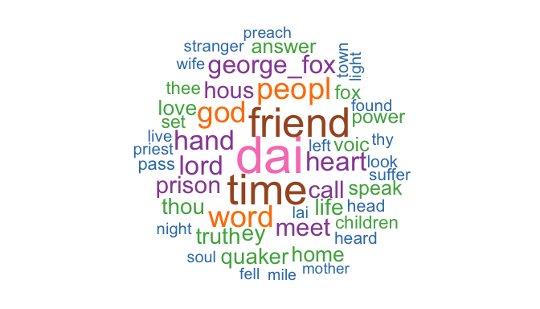
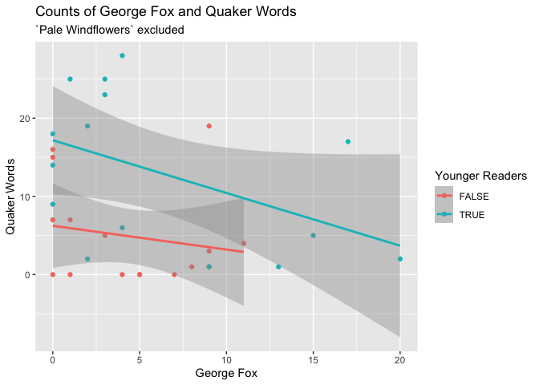
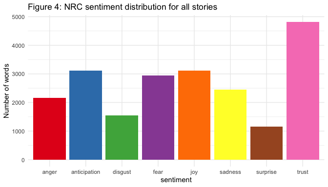
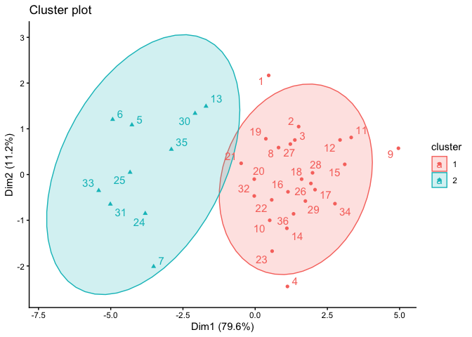
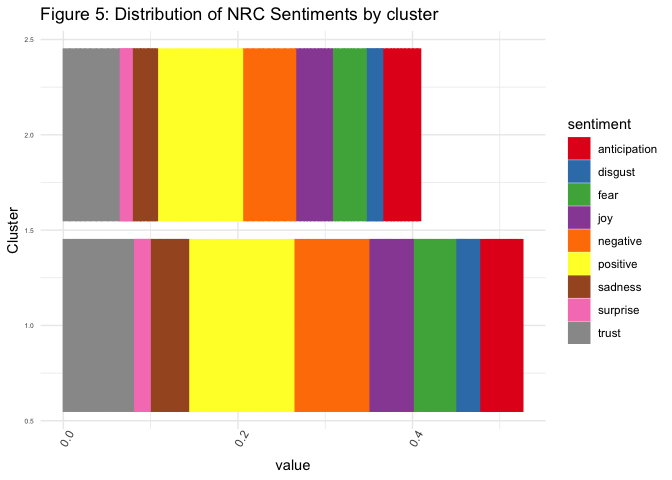
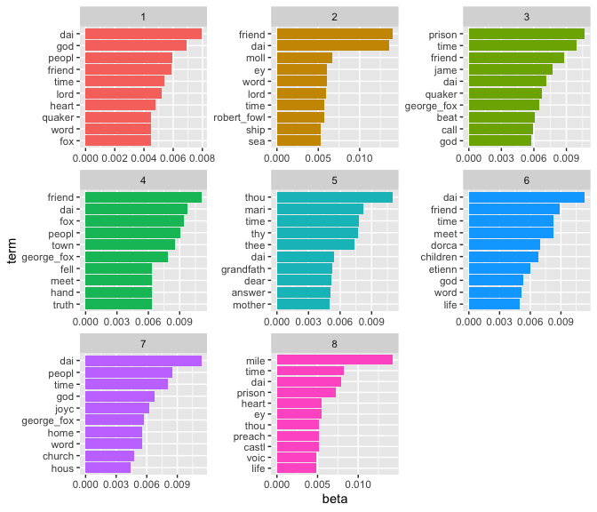
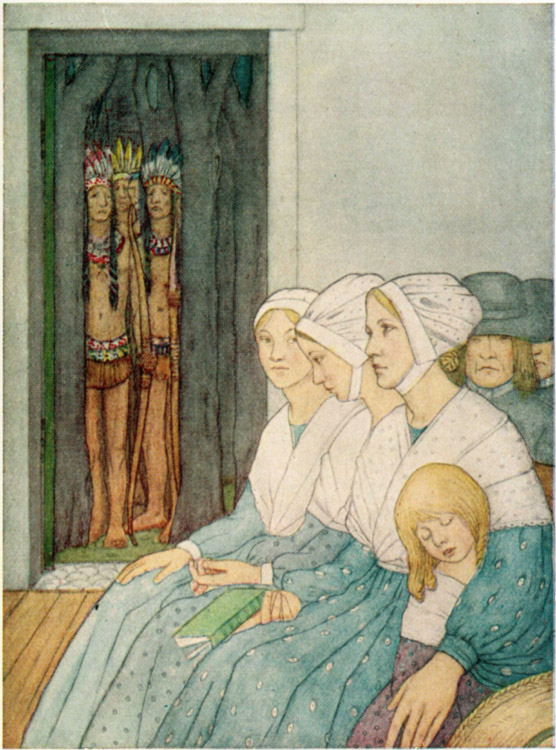

Quaker Stories and the Use of Quake Language
================
true

# Introduction

The Religious Society of Friends (Quakers) is a Protestant denomination
that was founded in England in the 1640s by George Fox. Some of the key
features of the religion are its commitment to the idea of that of God
in all, pacifism and simplicity. In the United States they are
associated with abolitionism.

J.V. Hodgkin was the daughter of a prominent Quaker family in England.
She wrote a number of books on Quaker topics and was deeply involved in
Quaker life in the United Kingdom. The most famous (still in print
today) is *A Book of Quaker Saints* (1917). The book contains a series
of historical stories, mainly about individuals who she describes as
“early Quaker saints.” Some of the stories are drawn from the journal of
George Fox, the founder of Quakerism.

In addition, there are stories of events involving multiple people, such
as “Fierce Feathers” and “Children of Reading Meeting.” These stories
are well-known and widely retold among Quakers. These stories are more
like stories of miracles than stories of individual saints.

What do these stories tell us about Quaker attitudes?  
Can computational text analysis give us any insights?

## Objectives

1.  To identify patterns across the stories.
2.  Ways in which the stories labelled as appropriate for children might
    differ from the other stories.
3.  To describe how these relate to Quaker ideas.

# Methods

To analyze these questions, the entire text was obtained from Project
Gutenburg. Following initial processing it was tokenized to individual
words and these were stemmed using the Porter 2 Snowball algorithm. For
common names the separate names were made into a single token, for
example “george fox” became “george_fox”. In cases where the same person
was referred to by different names (such as “etienne de grellet” being
recoded to “stephen_grellet”)

The original book includes extensive front matter, back matter and 32
stories. Each story also included an epigraph. For this analysis only
the main story texts were included.

Additional cleaning specifically related to this text included adding a
customized set of stop words (for archaic Quaker usage such are thou,
thee, thine and hast).

# Results

The most common words in the text are shown in Figure 1.

*Figure 1 Word Cloud*
<!-- -->

George Fox appears frequently as do the words God and Lord, but other
terms are also more ordinary, although perhaps what might be expected in
stories, such as time, day and people. The word friend is common; in
this context this has two potential meanings: Quakers are also called
Friends and the ordinary meaning of a person someone is friends with,
which might be common in stories for children.

# George Fox and Quaker words

Although Quaker words is concentrated in a few stories. In particular
“Pale Windflowers” uses 118 of them. The story is about the important
early Quaker leader William Dewsbury and his granddaughter. Most of the
Quaker words are part of dialogues between them or with her mother or
aunt.

The limitation that using “george_fox” rather that “fox” means that the
presence of mentions of Fox may be undercounted

<!-- -->

Overall, there is negative relationship between the frequency of
george_fox and the use of Quaker words. The stories for younger readers
generally have more uses of these terms, but they seem to be an
alternatives. That is, there are not many that have many uses of both.

# Sentiment Analysis

Sentiment analysis provides a way to interpret the words used in a body
of text. It uses standard lexicons to characterize individual words
used.

## The NRC lexicon

The NRC lexicon assigns descriptive terms to words; some words are
assigned multiple labels. In the book as a whole, “trust” was, by far,
the most frequently assigned sentiment. Anticipation, fear and joy
formed the second highest group. This approach gives a richer
understanding of the content.

<!-- -->

# Clustering the stories

Cluster analysis is a type of unsupervised machine learning that allows
identification of subgroups in data based on the similarity of
variables. In this case it is used to identify groups of stories that
have similar profiles on the NRC sentiments. For each story, the
proportion of words with each of the sentiments are the clustering
variables.

In the Quaker stories data there are two clearly defined clusters.

<!-- -->

Overall, however, the differences between the clusters are not primarily
about the sentiments expressed, but are in the extent to which any
sentiment is expressed. Cluster 2 expresses *more* sentiments than
Cluster 1, regardless of what the sentiment is.

<!-- -->

| cluster | N of Stories | Quaker Words | George Fox | For Younger |
|--------:|-------------:|-------------:|-----------:|------------:|
|       1 |           22 |           17 |         16 |           9 |
|       2 |           10 |            9 |          9 |           7 |

Characteristics of Stories in Clusters

The stories in cluster 2 have a much higher proportion of use of
george_fox and Quaker words and are more likely to be for younger
readers.

## Topic models

Topic modelling is another method of unsupervised machine learning. It
attempts to identify common topics that are characterised by use of
specific words. The same words can appear in multiple topics and each
document (in this case story) can contain multiple topics.

<!-- -->

Note: Add discussion of these topics here

<table class="table" style="font-size: 13px; margin-left: auto; margin-right: auto;">

<caption style="font-size: initial !important;">

Topic relationship to other story characteristics
</caption>

<thead>

<tr>

<th style="text-align:right;">

topic
</th>

<th style="text-align:right;">

N
</th>

<th style="text-align:right;">

Cluster 1
</th>

<th style="text-align:right;">

Cluster 2
</th>

<th style="text-align:right;">

Younger
</th>

<th style="text-align:right;">

Quaker Words
</th>

<th style="text-align:right;">

Fox
</th>

</tr>

</thead>

<tbody>

<tr>

<td style="text-align:right;">

1
</td>

<td style="text-align:right;">

5
</td>

<td style="text-align:right;">

3
</td>

<td style="text-align:right;">

2
</td>

<td style="text-align:right;">

2
</td>

<td style="text-align:right;">

3
</td>

<td style="text-align:right;">

5
</td>

</tr>

<tr>

<td style="text-align:right;">

2
</td>

<td style="text-align:right;">

3
</td>

<td style="text-align:right;">

1
</td>

<td style="text-align:right;">

2
</td>

<td style="text-align:right;">

3
</td>

<td style="text-align:right;">

3
</td>

<td style="text-align:right;">

3
</td>

</tr>

<tr>

<td style="text-align:right;">

3
</td>

<td style="text-align:right;">

2
</td>

<td style="text-align:right;">

2
</td>

<td style="text-align:right;">

0
</td>

<td style="text-align:right;">

1
</td>

<td style="text-align:right;">

2
</td>

<td style="text-align:right;">

1
</td>

</tr>

<tr>

<td style="text-align:right;">

4
</td>

<td style="text-align:right;">

6
</td>

<td style="text-align:right;">

5
</td>

<td style="text-align:right;">

1
</td>

<td style="text-align:right;">

2
</td>

<td style="text-align:right;">

5
</td>

<td style="text-align:right;">

5
</td>

</tr>

<tr>

<td style="text-align:right;">

5
</td>

<td style="text-align:right;">

3
</td>

<td style="text-align:right;">

1
</td>

<td style="text-align:right;">

2
</td>

<td style="text-align:right;">

2
</td>

<td style="text-align:right;">

2
</td>

<td style="text-align:right;">

2
</td>

</tr>

<tr>

<td style="text-align:right;">

6
</td>

<td style="text-align:right;">

6
</td>

<td style="text-align:right;">

6
</td>

<td style="text-align:right;">

0
</td>

<td style="text-align:right;">

4
</td>

<td style="text-align:right;">

5
</td>

<td style="text-align:right;">

4
</td>

</tr>

<tr>

<td style="text-align:right;">

7
</td>

<td style="text-align:right;">

4
</td>

<td style="text-align:right;">

3
</td>

<td style="text-align:right;">

1
</td>

<td style="text-align:right;">

0
</td>

<td style="text-align:right;">

3
</td>

<td style="text-align:right;">

2
</td>

</tr>

<tr>

<td style="text-align:right;">

8
</td>

<td style="text-align:right;">

3
</td>

<td style="text-align:right;">

1
</td>

<td style="text-align:right;">

2
</td>

<td style="text-align:right;">

2
</td>

<td style="text-align:right;">

3
</td>

<td style="text-align:right;">

3
</td>

</tr>

</tbody>

</table>

# Next Steps

The next step of this research will be to analyze the epigraphs
associated with each story. The similarities and differences with the
text of the stories will be explored.

Other collections of Quaker stories that are not always presented as
stories of saints and may be from different time periods will be
analyzed and compared to the *Quaker Saints*.

# Conclusion

Quantitative analysis of the text provides a distinctive way of
analyzing the Quaker stories. This analysis may also give us insights
into the kinds of stories that might have been thought of as appropriate
for children of different ages. In 1935 a collection *The Children’s
Story Caravan* and in 1962 an abridged version *Friendly Story Caravan*
with just 18 stories published. A 1990 edition contained just 18
stories. Many of the same incidents and people are included in these
later works, but some are excluded. Overall the idea of what kind of
stories would be most appropriate for children seemed to change
dramatically over those 80 years. This may reflect societal change in
ideas about children.

Frost (1971) discussed the Quaker practice of treating children as
“little adults” and its theological basis. Although his focus was on an
earlier period, this may be reflected in the creation of a book that is
not specifically for children. However, Hodgkin’s designation of some
stories as more suitable for children under age 9 may reflect some mixed
feelings about this in the early twentieth century. Compton’s work,
which is much more recent, describes one child recalling being very
upset about one particular story (The Children of Reading Meeting).

<figure>

<figcaption aria-hidden="true">Illustration of the Fierce Feathers
Story</figcaption>
</figure>

# Supplemental Materials

