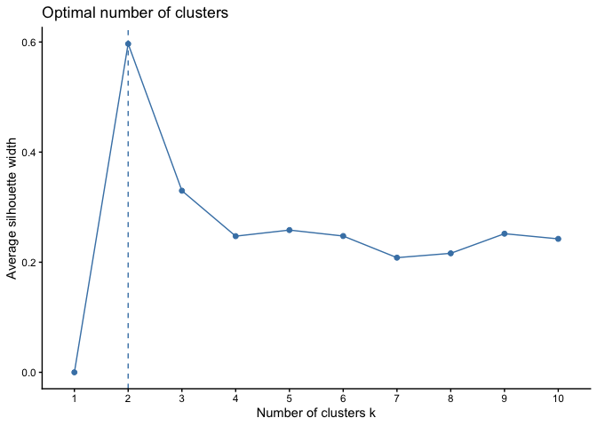
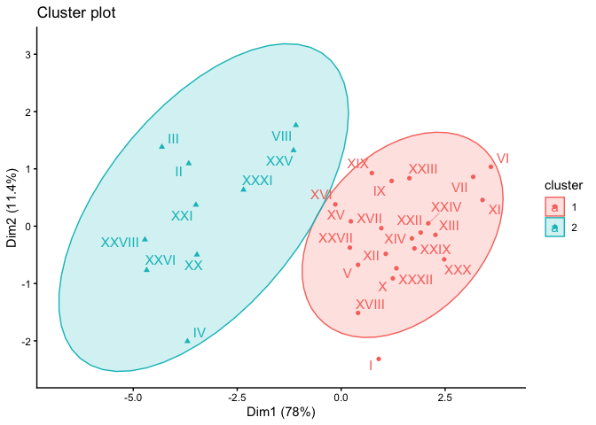

If the file doesn’t exist go back and run the qs_nrc file.

``` r
library(here)
library(dplyr)
library(tidyr)
library(cluster)
library(ggplot2)
library(factoextra)
library(knitr)
```

Let’s make a shorter version of the titles. I realized I needed to do
this after making the graphs.

``` r
if (!exists("qs_nrc" )){
  load(here("data/qs_nrc.rda"))
}
if (!exists("qs_tokens" )){
  load(here("data/qs_tokens.rda"))
}

qs_nrc$title_short <- sub("\\..*","", qs_nrc$section_title)

title_translate <- qs_nrc |> 
  group_by(section_title, title_short) |> 
  summarize(n_tokens = n())
```

    ## `summarise()` has regrouped the output.
    ## ℹ Summaries were computed grouped by section_title and title_short.
    ## ℹ Output is grouped by section_title.
    ## ℹ Use `summarise(.groups = "drop_last")` to silence this message.
    ## ℹ Use `summarise(.by = c(section_title, title_short))` for per-operation
    ##   grouping (`?dplyr::dplyr_by`) instead.

Remember from the nrc sentiment analysis “the most common emotion is
trust, followed by anticipation, joy and fear”

``` r
prop.table(table(qs_nrc$title_short, qs_nrc$sentiment), 2) |>
  round(2) |> kable(caption = "Sentiment by title")
```

|  | anger | anticipation | disgust | fear | joy | negative | positive | sadness | surprise | trust |
|:-------------|----:|--------:|-----:|----:|----:|------:|------:|-----:|------:|----:|
| A TALK ABOUT SAINTS | 0.01 | 0.03 | 0.01 | 0.01 | 0.04 | 0.02 | 0.03 | 0.02 | 0.04 | 0.03 |
| COME-TO-GOOD | 0.01 | 0.03 | 0.01 | 0.02 | 0.03 | 0.02 | 0.03 | 0.02 | 0.02 | 0.02 |
| HISTORICAL NOTES | 0.01 | 0.02 | 0.02 | 0.02 | 0.02 | 0.02 | 0.02 | 0.02 | 0.02 | 0.03 |
| I | 0.04 | 0.01 | 0.04 | 0.03 | 0.01 | 0.03 | 0.02 | 0.03 | 0.01 | 0.02 |
| II | 0.05 | 0.05 | 0.04 | 0.04 | 0.06 | 0.04 | 0.05 | 0.04 | 0.04 | 0.05 |
| III | 0.05 | 0.05 | 0.04 | 0.04 | 0.05 | 0.04 | 0.05 | 0.04 | 0.06 | 0.05 |
| IV | 0.06 | 0.04 | 0.05 | 0.06 | 0.04 | 0.05 | 0.03 | 0.04 | 0.04 | 0.03 |
| IX | 0.02 | 0.03 | 0.01 | 0.02 | 0.03 | 0.03 | 0.03 | 0.03 | 0.03 | 0.02 |
| PREFACE | 0.01 | 0.01 | 0.01 | 0.01 | 0.01 | 0.01 | 0.01 | 0.01 | 0.01 | 0.01 |
| V | 0.03 | 0.03 | 0.03 | 0.02 | 0.02 | 0.03 | 0.02 | 0.03 | 0.03 | 0.02 |
| VI | 0.01 | 0.01 | 0.01 | 0.01 | 0.02 | 0.01 | 0.02 | 0.01 | 0.02 | 0.02 |
| VII | 0.01 | 0.02 | 0.01 | 0.01 | 0.02 | 0.01 | 0.02 | 0.01 | 0.01 | 0.02 |
| VIII | 0.02 | 0.04 | 0.04 | 0.02 | 0.04 | 0.03 | 0.04 | 0.02 | 0.04 | 0.04 |
| X | 0.03 | 0.02 | 0.03 | 0.02 | 0.01 | 0.03 | 0.02 | 0.04 | 0.03 | 0.02 |
| XI | 0.01 | 0.01 | 0.01 | 0.01 | 0.01 | 0.02 | 0.02 | 0.02 | 0.01 | 0.02 |
| XII | 0.03 | 0.02 | 0.03 | 0.02 | 0.02 | 0.02 | 0.02 | 0.03 | 0.03 | 0.03 |
| XIII | 0.02 | 0.02 | 0.02 | 0.02 | 0.02 | 0.02 | 0.02 | 0.02 | 0.02 | 0.02 |
| XIV | 0.03 | 0.02 | 0.03 | 0.01 | 0.02 | 0.03 | 0.02 | 0.02 | 0.01 | 0.02 |
| XIX | 0.02 | 0.03 | 0.02 | 0.02 | 0.03 | 0.03 | 0.03 | 0.03 | 0.02 | 0.03 |
| XV | 0.02 | 0.03 | 0.04 | 0.03 | 0.03 | 0.02 | 0.03 | 0.02 | 0.03 | 0.03 |
| XVI | 0.03 | 0.03 | 0.03 | 0.03 | 0.03 | 0.03 | 0.03 | 0.02 | 0.03 | 0.03 |
| XVII | 0.02 | 0.02 | 0.02 | 0.02 | 0.02 | 0.03 | 0.02 | 0.03 | 0.03 | 0.02 |
| XVIII | 0.03 | 0.02 | 0.04 | 0.03 | 0.02 | 0.03 | 0.02 | 0.04 | 0.02 | 0.02 |
| XX | 0.05 | 0.04 | 0.05 | 0.05 | 0.05 | 0.05 | 0.04 | 0.05 | 0.04 | 0.04 |
| XXI | 0.04 | 0.04 | 0.04 | 0.04 | 0.05 | 0.04 | 0.05 | 0.06 | 0.04 | 0.05 |
| XXII | 0.02 | 0.02 | 0.02 | 0.02 | 0.02 | 0.02 | 0.02 | 0.02 | 0.03 | 0.02 |
| XXIII | 0.02 | 0.02 | 0.03 | 0.02 | 0.03 | 0.02 | 0.03 | 0.02 | 0.02 | 0.03 |
| XXIV | 0.02 | 0.02 | 0.02 | 0.02 | 0.02 | 0.02 | 0.02 | 0.02 | 0.02 | 0.02 |
| XXIX | 0.02 | 0.02 | 0.02 | 0.03 | 0.02 | 0.02 | 0.02 | 0.02 | 0.02 | 0.02 |
| XXV | 0.03 | 0.05 | 0.03 | 0.03 | 0.03 | 0.03 | 0.05 | 0.02 | 0.03 | 0.04 |
| XXVI | 0.06 | 0.05 | 0.04 | 0.06 | 0.04 | 0.05 | 0.05 | 0.05 | 0.05 | 0.05 |
| XXVII | 0.03 | 0.03 | 0.03 | 0.04 | 0.02 | 0.03 | 0.03 | 0.03 | 0.02 | 0.02 |
| XXVIII | 0.05 | 0.05 | 0.05 | 0.06 | 0.05 | 0.05 | 0.05 | 0.04 | 0.05 | 0.04 |
| XXX | 0.02 | 0.01 | 0.03 | 0.02 | 0.01 | 0.02 | 0.01 | 0.02 | 0.02 | 0.01 |
| XXXI | 0.04 | 0.04 | 0.03 | 0.04 | 0.04 | 0.04 | 0.04 | 0.04 | 0.04 | 0.04 |
| XXXII | 0.03 | 0.02 | 0.03 | 0.03 | 0.02 | 0.02 | 0.02 | 0.03 | 0.02 | 0.02 |

Sentiment by title

``` r
table(qs_nrc$title_short, qs_nrc$sentiment) |>
  prop.table() |>
  as.data.frame() |> 
  pivot_wider(values_from = Freq, names_from = Var2) -> 
  nrcdata
```

I’m going to subset the data so it is just the stories and to drop the
“negative” and “positive” sentiments.

``` r
nrcdata |> filter(!Var1 %in% c("A TALK ABOUT SAINTS", 
                               "COME-TO-GOOD",
                               "HISTORICAL NOTES",
                               "PREFACE") ) |>
            select(-positive, -negative) ->
  nrcdata
```

I am interested in the question of whether there are patterns of
similarity between the stories.

First I am going to calculate “how far apart” the stories are using a
distance measure (see separate file explaining this). For this I use the
function `dist()`.  
By reading ?dist you can see that there are difference methods to
calculate distance:

“euclidean”, “maximum”, “manhattan”, “canberra”, “binary” or “minkowski”

The default is euclidean so I’ll use that first.

I don’t want to use the first column for the calculation so to keep the
labels I am going to creat row.names.

``` r
nrcdata <- as.data.frame(nrcdata)
rownames(nrcdata) <- nrcdata$Var1
nrcdata <- nrcdata[-1]
```

The distance object shows how far apart the stories are from each other.
This is a distance – think of it like inches. Higher distances means the
chapters are farther apart. A distance of 0 means that they are in the
same location.

``` r
qs_dist <- dist(nrcdata)
qs_dist 
```

    ##                   I           II          III           IV           IX
    ## II     0.0075960618                                                    
    ## III    0.0078041736 0.0011470913                                       
    ## IV     0.0051760771 0.0041868137 0.0045433238                          
    ## IX     0.0031394546 0.0061083623 0.0062681950 0.0054291746             
    ## V      0.0018448579 0.0067758464 0.0069592785 0.0049958692 0.0018198360
    ## VI     0.0034415327 0.0082801838 0.0084569912 0.0073463014 0.0025452882
    ## VII    0.0032735570 0.0077312232 0.0079066822 0.0069514707 0.0021345725
    ## VIII   0.0056036327 0.0035305332 0.0037924010 0.0048892361 0.0036168525
    ## X      0.0014534820 0.0072590749 0.0073738197 0.0055345738 0.0020424993
    ## XI     0.0031647327 0.0082513186 0.0083894538 0.0072861895 0.0024472114
    ## XII    0.0020479405 0.0065111850 0.0066412821 0.0051535826 0.0018532836
    ## XIII   0.0020344197 0.0074094707 0.0076248972 0.0059299882 0.0020263078
    ## XIV    0.0024302363 0.0068272217 0.0070242809 0.0057063562 0.0016796620
    ## XIX    0.0036169755 0.0051206553 0.0053230265 0.0048859574 0.0010815795
    ## XV     0.0030039595 0.0052777605 0.0054947797 0.0045468496 0.0017790190
    ## XVI    0.0036506624 0.0044754090 0.0047129849 0.0041305117 0.0022457465
    ## XVII   0.0022059496 0.0063698452 0.0065514639 0.0050841015 0.0012549450
    ## XVIII  0.0013446701 0.0063594243 0.0065535698 0.0044361481 0.0022829013
    ## XX     0.0059349404 0.0020922370 0.0024979791 0.0025164435 0.0050410174
    ## XXI    0.0068343899 0.0019565683 0.0018436511 0.0039462129 0.0054484897
    ## XXII   0.0020531504 0.0074782395 0.0076632144 0.0059870632 0.0018960245
    ## XXIII  0.0033795368 0.0061990715 0.0064076786 0.0058199732 0.0015526913
    ## XXIV   0.0022411830 0.0070900059 0.0072751845 0.0058050397 0.0018645382
    ## XXIX   0.0018225246 0.0070821536 0.0073652426 0.0053608575 0.0020359507
    ## XXV    0.0056041888 0.0030731059 0.0032113678 0.0042616312 0.0040481098
    ## XXVI   0.0072525719 0.0024858321 0.0026255205 0.0028260589 0.0067039235
    ## XXVII  0.0025972241 0.0054252377 0.0057538210 0.0037825287 0.0022248369
    ## XXVIII 0.0073315625 0.0020939384 0.0025758842 0.0028710636 0.0065670725
    ## XXX    0.0021209744 0.0082412244 0.0084144074 0.0066717757 0.0025774390
    ## XXXI   0.0058781165 0.0018578416 0.0021948232 0.0033229526 0.0044847487
    ## XXXII  0.0015307481 0.0068693414 0.0071293249 0.0051066405 0.0018366359
    ##                   V           VI          VII         VIII            X
    ## II                                                                     
    ## III                                                                    
    ## IV                                                                     
    ## IX                                                                     
    ## V                                                                      
    ## VI     0.0029348524                                                    
    ## VII    0.0027035372 0.0006797425                                       
    ## VIII   0.0044328355 0.0053641779 0.0048118741                          
    ## X      0.0014708349 0.0024808131 0.0022558327 0.0050141015             
    ## XI     0.0028143789 0.0007848991 0.0007728977 0.0054290106 0.0021251677
    ## XII    0.0017996669 0.0025675760 0.0021549121 0.0042175333 0.0012868184
    ## XIII   0.0018242335 0.0015796917 0.0014178254 0.0048505717 0.0012715068
    ## XIV    0.0016764788 0.0021499488 0.0017256743 0.0041754221 0.0017850140
    ## XIX    0.0024295036 0.0032689304 0.0027489286 0.0026770638 0.0027209341
    ## XV     0.0021703494 0.0032850949 0.0027325247 0.0027112647 0.0023949963
    ## XVI    0.0028933035 0.0039624229 0.0034081296 0.0022413816 0.0030726714
    ## XVII   0.0013979062 0.0024221637 0.0020479405 0.0039791262 0.0012094267
    ## XVIII  0.0015884030 0.0033618407 0.0029858265 0.0044334380 0.0012798813
    ## XX     0.0053511337 0.0072448344 0.0067215625 0.0034588211 0.0057758275
    ## XXI    0.0061364268 0.0077466957 0.0071994713 0.0038372085 0.0063993369
    ## XXII   0.0013841460 0.0016388848 0.0015131997 0.0048055795 0.0012992118
    ## XXIII  0.0024586441 0.0022595788 0.0016553700 0.0032400709 0.0024651532
    ## XXIV   0.0019504159 0.0016607394 0.0013433453 0.0045255555 0.0013506156
    ## XXIX   0.0015388688 0.0022077650 0.0020538007 0.0047005012 0.0013994975
    ## XXV    0.0047817146 0.0058038126 0.0052551930 0.0018573623 0.0051236101
    ## XXVI   0.0068834533 0.0087794449 0.0082769576 0.0049337361 0.0072533698
    ## XXVII  0.0019773882 0.0036729083 0.0032932149 0.0034459275 0.0024481207
    ## XXVIII 0.0067678927 0.0086912880 0.0082003430 0.0045217178 0.0072981539
    ## XXX    0.0020095430 0.0015729143 0.0016073464 0.0055407633 0.0015348138
    ## XXXI   0.0051488298 0.0066152251 0.0060749680 0.0026083405 0.0054850498
    ## XXXII  0.0011628928 0.0024963748 0.0022548458 0.0045803061 0.0010570186
    ##                  XI          XII         XIII          XIV          XIX
    ## II                                                                     
    ## III                                                                    
    ## IV                                                                     
    ## IX                                                                     
    ## V                                                                      
    ## VI                                                                     
    ## VII                                                                    
    ## VIII                                                                   
    ## X                                                                      
    ## XI                                                                     
    ## XII    0.0023480715                                                    
    ## XIII   0.0015729143 0.0013886411                                       
    ## XIV    0.0020095430 0.0012153013 0.0014405619                          
    ## XIX    0.0032173226 0.0021299798 0.0026419148 0.0021129842             
    ## XV     0.0032063739 0.0016668928 0.0023362883 0.0019323019 0.0013333673
    ## XVI    0.0039158657 0.0022615479 0.0030335980 0.0026697375 0.0014156260
    ## XVII   0.0022949586 0.0010477130 0.0012843946 0.0014924659 0.0017395478
    ## XVIII  0.0030836618 0.0012439006 0.0019035224 0.0019472181 0.0024881589
    ## XX     0.0071383725 0.0051886177 0.0061205200 0.0056822010 0.0042052724
    ## XXI    0.0075812800 0.0058796309 0.0068175000 0.0063681678 0.0046029911
    ## XXII   0.0016208595 0.0015844748 0.0007357200 0.0012669476 0.0026422518
    ## XXIII  0.0022552406 0.0017697368 0.0019615670 0.0014939565 0.0015400254
    ## XXIV   0.0016227808 0.0010844566 0.0005001657 0.0013087699 0.0023548863
    ## XXIX   0.0022635153 0.0014984192 0.0007734735 0.0016415987 0.0025580230
    ## XXV    0.0058263179 0.0043430568 0.0050626053 0.0045875891 0.0030502800
    ## XXVI   0.0087055144 0.0066389358 0.0075822194 0.0072082457 0.0058520844
    ## XXVII  0.0037057265 0.0020762190 0.0023735261 0.0023909038 0.0019778384
    ## XXVIII 0.0086741649 0.0067293725 0.0075477383 0.0071942758 0.0057074482
    ## XXX    0.0013446701 0.0020028866 0.0011693819 0.0016770098 0.0033767696
    ## XXXI   0.0065581869 0.0047823662 0.0056669044 0.0052268254 0.0035223284
    ## XXXII  0.0023847520 0.0014023572 0.0010679117 0.0016161841 0.0023815767
    ##                  XV          XVI         XVII        XVIII           XX
    ## II                                                                     
    ## III                                                                    
    ## IV                                                                     
    ## IX                                                                     
    ## V                                                                      
    ## VI                                                                     
    ## VII                                                                    
    ## VIII                                                                   
    ## X                                                                      
    ## XI                                                                     
    ## XII                                                                    
    ## XIII                                                                   
    ## XIV                                                                    
    ## XIX                                                                    
    ## XV                                                                     
    ## XVI    0.0009147969                                                    
    ## XVII   0.0014519499 0.0021000942                                       
    ## XVIII  0.0018587997 0.0023927649 0.0013708972                          
    ## XX     0.0041135574 0.0034089132 0.0050253635 0.0047698774             
    ## XXI    0.0048176061 0.0040721201 0.0056833760 0.0055902714 0.0017436372
    ## XXII   0.0023931369 0.0031811468 0.0013793137 0.0020223498 0.0062051721
    ## XXIII  0.0013604670 0.0019631549 0.0015903635 0.0025243910 0.0052760734
    ## XXIV   0.0020302582 0.0026880157 0.0011369571 0.0018405097 0.0058612809
    ## XXIX   0.0022069583 0.0028473998 0.0011667143 0.0016418698 0.0057033912
    ## XXV    0.0030748436 0.0023648835 0.0042745636 0.0044174449 0.0030265466
    ## XXVI   0.0057220141 0.0049855228 0.0066313549 0.0062077541 0.0021730140
    ## XXVII  0.0015076002 0.0017101274 0.0017588880 0.0017077831 0.0040729945
    ## XXVIII 0.0055982284 0.0048744647 0.0065477259 0.0062757890 0.0019049249
    ## XXX    0.0030680321 0.0038881446 0.0020252092 0.0024426598 0.0069141665
    ## XXXI   0.0036066230 0.0027703816 0.0046224843 0.0046131340 0.0013121667
    ## XXXII  0.0020210287 0.0026933096 0.0009425970 0.0012013022 0.0054134097
    ##                 XXI         XXII        XXIII         XXIV         XXIX
    ## II                                                                     
    ## III                                                                    
    ## IV                                                                     
    ## IX                                                                     
    ## V                                                                      
    ## VI                                                                     
    ## VII                                                                    
    ## VIII                                                                   
    ## X                                                                      
    ## XI                                                                     
    ## XII                                                                    
    ## XIII                                                                   
    ## XIV                                                                    
    ## XIX                                                                    
    ## XV                                                                     
    ## XVI                                                                    
    ## XVII                                                                   
    ## XVIII                                                                  
    ## XX                                                                     
    ## XXI                                                                    
    ## XXII   0.0068974719                                                    
    ## XXIII  0.0058061898 0.0020201475                                       
    ## XXIV   0.0065108431 0.0009989956 0.0016345333                          
    ## XXIX   0.0065320710 0.0010616409 0.0021701443 0.0010297141             
    ## XXV    0.0032146928 0.0051371453 0.0038677126 0.0047027734 0.0049168355
    ## XXVI   0.0026825453 0.0076972361 0.0069150677 0.0073091853 0.0071774885
    ## XXVII  0.0049964037 0.0024586441 0.0024390124 0.0022639086 0.0018983707
    ## XXVIII 0.0026373617 0.0076256561 0.0067757807 0.0073068707 0.0070864892
    ## XXX    0.0076023295 0.0009397593 0.0025367043 0.0014771766 0.0016456610
    ## XXXI   0.0016812513 0.0057864532 0.0046117829 0.0053467231 0.0053542938
    ## XXXII  0.0062048852 0.0011559821 0.0021903568 0.0012496131 0.0006294204
    ##                 XXV         XXVI        XXVII       XXVIII          XXX
    ## II                                                                     
    ## III                                                                    
    ## IV                                                                     
    ## IX                                                                     
    ## V                                                                      
    ## VI                                                                     
    ## VII                                                                    
    ## VIII                                                                   
    ## X                                                                      
    ## XI                                                                     
    ## XII                                                                    
    ## XIII                                                                   
    ## XIV                                                                    
    ## XIX                                                                    
    ## XV                                                                     
    ## XVI                                                                    
    ## XVII                                                                   
    ## XVIII                                                                  
    ## XX                                                                     
    ## XXI                                                                    
    ## XXII                                                                   
    ## XXIII                                                                  
    ## XXIV                                                                   
    ## XXIX                                                                   
    ## XXV                                                                    
    ## XXVI   0.0038654101                                                    
    ## XXVII  0.0033456479 0.0054249915                                       
    ## XXVIII 0.0037996714 0.0013202833 0.0052982999                          
    ## XXX    0.0059245810 0.0084380213 0.0032655244 0.0084066273             
    ## XXXI   0.0019522408 0.0026946315 0.0037464638 0.0025183885 0.0065386779
    ## XXXII  0.0047842274 0.0069378821 0.0017446581 0.0068542263 0.0017308256
    ##                XXXI
    ## II                 
    ## III                
    ## IV                 
    ## IX                 
    ## V                  
    ## VI                 
    ## VII                
    ## VIII               
    ## X                  
    ## XI                 
    ## XII                
    ## XIII               
    ## XIV                
    ## XIX                
    ## XV                 
    ## XVI                
    ## XVII               
    ## XVIII              
    ## XX                 
    ## XXI                
    ## XXII               
    ## XXIII              
    ## XXIV               
    ## XXIX               
    ## XXV                
    ## XXVI               
    ## XXVII              
    ## XXVIII             
    ## XXX                
    ## XXXI               
    ## XXXII  0.0051321172

``` r
max(qs_dist)
```

    ## [1] 0.008779445

``` r
min(qs_dist)
```

    ## [1] 0.0005001657

The furthest apart are XXVI and VI.  
XXVI. RICHARD SELLAR AND THE ‘MERCIFUL MAN’  
VI. THE SHEPHERD OF PENDLE HILL

The closes are XXIV and XIII  
XIII. MAGNANIMITY XXIV. THE VICTORY OF AMOR STODDART

When I write up the project The Shepherd of Pendle Hill is one I will
definitely talk about because it has come up in a number of the
analyses.

``` r
fviz_nbclust(nrcdata, pam, method = "silhouette")+
  theme_classic()
```



So there are two clusters. This is interesting because in some of the
other analyses it looked like there are stories about George Fox and
everything else.

``` r
pam(qs_dist, k = 2, metric = "euclidean", stand = FALSE) -> k2

dd <- cbind(nrcdata, cluster = k2$cluster) 
dd$title_short <- rownames(dd)
dd <- dd |>  left_join(title_translate, by = "title_short")


qs_tokens |>  
  filter(text_type == "Story" & title_type == "main") |>
  group_by(section_title) |>
  summarize(`George Fox` = sum(word == "george_fox"), 
            `Quaker Words` = sum(quaker_word == "Yes"),
            `Younger Readers` = unique(younger)) ->
  quaker_counts
```

``` r
k2$data <- nrcdata
k2$diss <- qs_dist
fviz_cluster(k2,
    ##palette = c("#00AFBB", "#FC4E07"), # color palette
    ellipse.type = "t", # Concentration ellipse
    repel = TRUE, # Avoid label overplotting (slow)
    ggtheme = theme_classic()
)
```



Story 1 is ” ‘STIFF AS A TREE, PURE AS A BELL’” Story 9 is “Strike
again”

The stand somewhat outside the ellipses. Both are retellings (sometimes
direct quotations from) of passages in the Journal of George Fox.

``` r
dd |> select(cluster, section_title) |> 
  arrange(cluster, section_title) |>
  kable(caption = "Cluster assignments for stories")
```

| cluster | section_title                                            |
|--------:|:---------------------------------------------------------|
|       1 | I. ‘STIFF AS A TREE, PURE AS A BELL’                     |
|       1 | IX\. UNDER THE YEW-TREES                                 |
|       1 | V. ‘THE MAN IN LEATHER BREECHES’                         |
|       1 | VI\. THE SHEPHERD OF PENDLE HILL                         |
|       1 | VII\. THE PEOPLE IN WHITE RAIMENT                        |
|       1 | X. ‘BEWITCHED!’                                          |
|       1 | XI\. THE JUDGE’S RETURN                                  |
|       1 | XII\. ‘STRIKE AGAIN!’                                    |
|       1 | XIII\. MAGNANIMITY                                       |
|       1 | XIV\. MILES HALHEAD AND THE HAUGHTY LADY                 |
|       1 | XIX\. THE CHILDREN OF READING MEETING                    |
|       1 | XV\. SCATTERING THE SEED                                 |
|       1 | XVI\. WRESTLING FOR GOD                                  |
|       1 | XVII\. LITTLE JAMES AND HIS JOURNEYS                     |
|       1 | XVIII\. THE FIRST QUAKER MARTYR                          |
|       1 | XXII\. AN UNDISTURBED MEETING                            |
|       1 | XXIII\. BUTTERFLIES IN THE FELLS                         |
|       1 | XXIV\. THE VICTORY OF AMOR STODDART                      |
|       1 | XXIX\. FIERCE FEATHERS                                   |
|       1 | XXVII\. TWO ROBBER STORIES. WEST AND EAST                |
|       1 | XXX\. THE THIEF IN THE TANYARD                           |
|       1 | XXXII\. PREACHING TO NOBODY                              |
|       2 | II\. ‘PURE FOY, MA JOYE’                                 |
|       2 | III\. THE ANGEL OF BEVERLEY                              |
|       2 | IV\. TAMING THE TIGER                                    |
|       2 | VIII\. A WONDERFUL FORTNIGHT                             |
|       2 | XX\. THE SADDEST STORY OF ALL                            |
|       2 | XXI\. PALE WIND FLOWERS: OR THE LITTLE PRISON MAID       |
|       2 | XXV\. THE MARVELLOUS VOYAGE OF THE GOOD SHIP ‘WOODHOUSE’ |
|       2 | XXVI\. RICHARD SELLAR AND THE ‘MERCIFUL MAN’             |
|       2 | XXVIII\. SILVER SLIPPERS: OR A QUAKERESS AMONG THE TURKS |
|       2 | XXXI\. HOW A FRENCH NOBLE BECAME A FRIEND                |

Cluster assignments for stories

``` r
dd <- dd |> left_join(quaker_counts)
```

    ## Joining with `by = join_by(section_title)`

``` r
dd |> group_by(cluster) |> 
  summarize(`N of Stories` = n(),
            `Quaker Words` = sum(`Quaker Words` > 0),
            `George Fox` = sum(`George Fox` > 0),
            `For Younger` = sum(`Younger Readers`)) |>
  kable(caption = "Characteristics of Stories")
```

| cluster | N of Stories | Quaker Words | George Fox | For Younger |
|--------:|-------------:|-------------:|-----------:|------------:|
|       1 |           22 |           17 |         16 |           9 |
|       2 |           10 |            9 |          9 |           7 |

Characteristics of Stories

The Stories in Cluster 1 are less likely to include “george_fox” or use
Quaker words, but even more dramatic is that they are less than half as
likely to be in the appropriate for younger children category.
