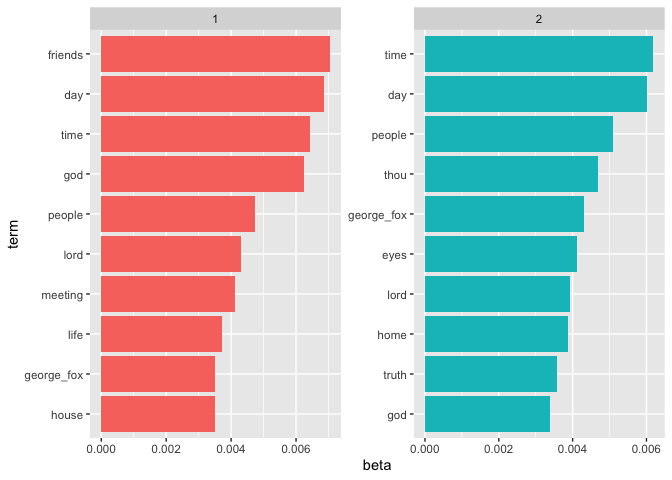
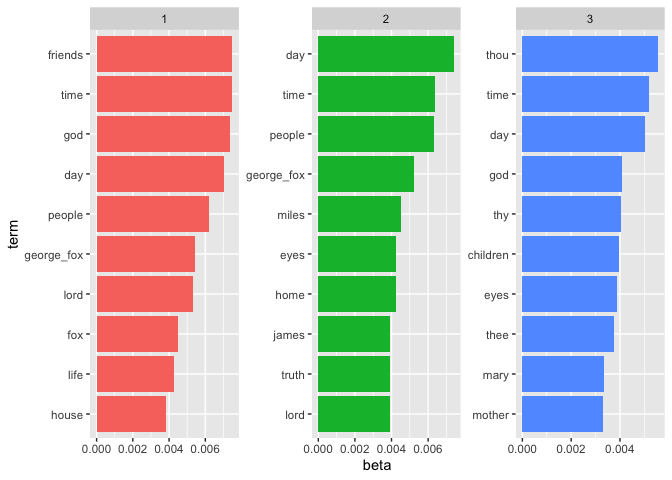
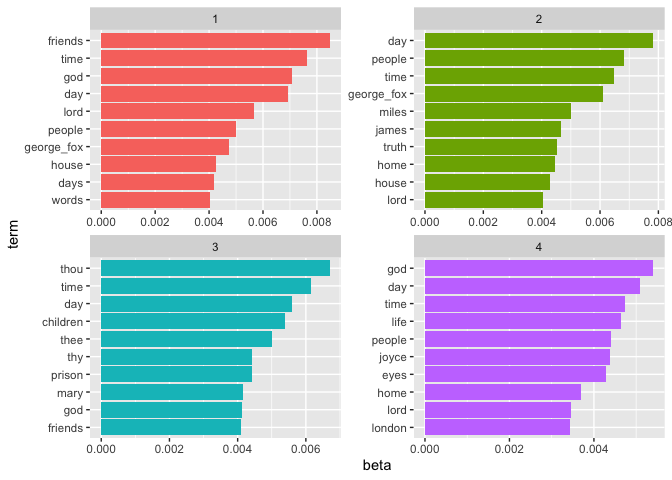
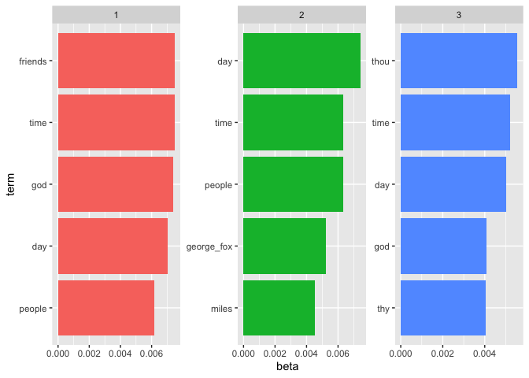
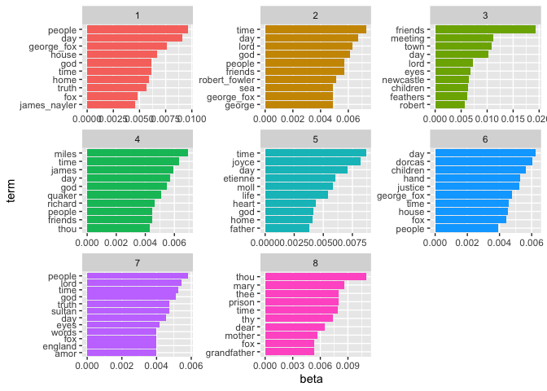
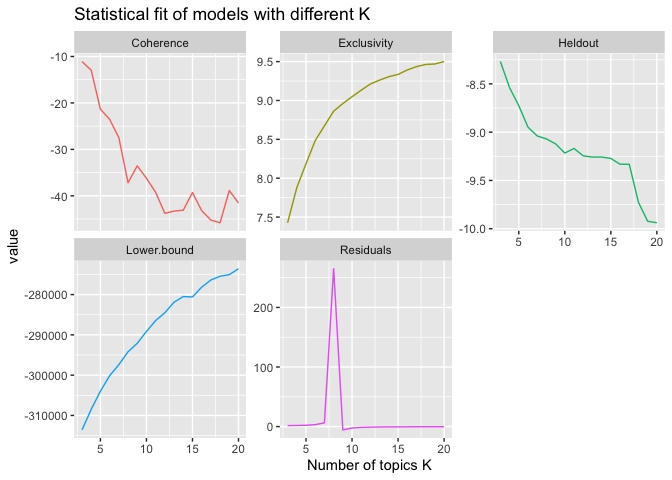
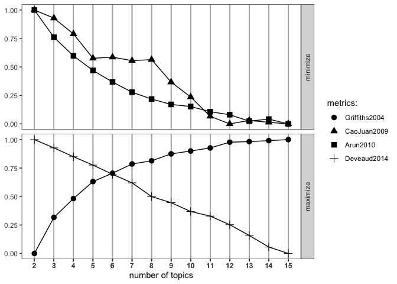

Topic Models
================

``` r
library(here)
```

    ## here() starts at /Users/elinwaring/Code/rcode/quakersaints-example

``` r
library(dplyr)
```

    ## 
    ## Attaching package: 'dplyr'

    ## The following objects are masked from 'package:stats':
    ## 
    ##     filter, lag

    ## The following objects are masked from 'package:base':
    ## 
    ##     intersect, setdiff, setequal, union

``` r
library(tidytext)
library(tidyr)
library(knitr)
library(ggplot2)
library(tm)
```

    ## Loading required package: NLP

    ## 
    ## Attaching package: 'NLP'

    ## The following object is masked from 'package:ggplot2':
    ## 
    ##     annotate

``` r
library(topicmodels)
# needed if you are not on the server, but just once
#devtools::install_github("nikita-moor/ldatuning")
library(ldatuning)
library(stm)
```

    ## stm v1.3.8 successfully loaded. See ?stm for help. 
    ##  Papers, resources, and other materials at structuraltopicmodel.com

``` r
library(quanteda)
```

    ## Package version: 4.3.1
    ## Unicode version: 14.0
    ## ICU version: 71.1

    ## Parallel computing: disabled

    ## See https://quanteda.io for tutorials and examples.

    ## 
    ## Attaching package: 'quanteda'

    ## The following object is masked from 'package:tm':
    ## 
    ##     stopwords

    ## The following objects are masked from 'package:NLP':
    ## 
    ##     meta, meta<-

To do this analysis in this file, you will need to copy your saved
tokenized data.

In this project we are going to take a first look at a method of
analysis called *topic models*. Topic models are a kind of machine
learning that analyzes

# Document-Term Matrix

So far we have been focused on *words* as our units. For example, in the
sentiment analysis each row represented one word, and there was a column
that represented the specific document (story, chapter, book, etc).

In this analysis we will change perspective: the document will represent
the observation, so each document will will be a row.

The columns will represent “terms.” In this case the terms will be
individual words. So each word acts like a variable. The values in the
column will be the frequency of that term in the specific document.

These usually end up very wide (because there are a lot of words) and
relatively short (because there are not that many documents compared to
the number of words).

``` r
fake_data_dtm <- data.frame(
  "Document" = c("Book 1", "Book 2", "Book 3"),
  "Cat" = c(0, 4, 1),
  "Sky" = c(0, 0, 1),
  "House" = c(3, 1, 1)
)
fake_data_dtm
```

    ##   Document Cat Sky House
    ## 1   Book 1   0   0     3
    ## 2   Book 2   4   0     1
    ## 3   Book 3   1   1     1

Notice that there are three 0s. This is important later! This happens
when there are words that do not appear in a given document.

``` r
fake_data_long <- data.frame(
  "Word" = c("Cat", "Cat", "Sky", "House", "House", "House"),
  "n" = c(4, 1, 1, 3, 1, 1),
  "Document" = c("Book 2", "Book 3", "Book 3", "Book 1", "Book 2", "Book 3")
)
fake_data_long
```

    ##    Word n Document
    ## 1   Cat 4   Book 2
    ## 2   Cat 1   Book 3
    ## 3   Sky 1   Book 3
    ## 4 House 3   Book 1
    ## 5 House 1   Book 2
    ## 6 House 1   Book 3

``` r
cast_dtm(fake_data_long, Document, Word,  n) -> fake_dtm

fake_dtm$v
```

    ## [1] 4 1 1 1 1 3

``` r
fake_dtm
```

    ## <<DocumentTermMatrix (documents: 3, terms: 3)>>
    ## Non-/sparse entries: 6/3
    ## Sparsity           : 33%
    ## Maximal term length: 5
    ## Weighting          : term frequency (tf)

``` r
dimnames(fake_dtm)
```

    ## $Docs
    ## [1] "Book 2" "Book 3" "Book 1"
    ## 
    ## $Terms
    ## [1] "Cat"   "Sky"   "House"

Notice that we get two dimenisons, one for the words and one for the
terms.

Looking above you can remind yourself that we had three 0s and 6 other
numbers.

Term-data matrices are often *sparse* because of these 0s. You can see
the two dfferent sparsity measures.

In terms of computing, we often don’t want to have to take up space for
all the 0s so we change (cast) the matrix ti a “sparse” matrix.

``` r
cast_sparse(fake_data_long,Document,  Word,  n) -> fake_sparse
fake_sparse
```

    ## 3 x 3 sparse Matrix of class "dgCMatrix"
    ##        Cat Sky House
    ## Book 2   4   .     1
    ## Book 3   1   1     1
    ## Book 1   .   .     3

There are a few different packages that do this analysis. We are going
to using the `tm` packages.

``` r
load(here("data/qs_tokens.rda"))

qs_tokens |> 
  filter(text_type == "Story", 
         title == "Text",
         title_type == "main") ->
  qs_tokens_stories

qs_tokens_stories |> group_by(section_title, word) |> 
  summarize(n = n()) |>
cast_dtm( term = word, document=section_title, n) -> quakersaints_dtm
```

    ## `summarise()` has grouped output by 'section_title'. You can override using the
    ## `.groups` argument.

Now I have a “large DocumentTermMatrix” in my environment.

# Latent Dirichlet allocation (LDA)

LDA “treats each document as a mixture of topics, and each topic as a
mixture of words” (chapter 6).

This means that each document can have multiple topics.  
Each of the topics is made up of a mixture of words/terms.

Just like with cluster analysis, we need to provide the parameter *k*
which is the number of topics to be identified. In this sense topic
models depend on the user, so you must have some judgement. Often what
we do is to try various values of *k* to find the best solution.

The algorithm finds the best solution for a given number of topics.

*This means that you can get different answers each time you run the
analysis!!!*

But a solid analysis should give you pretty simlar answers.

It requires a random number to start; we can specify a specific value
which will let us reproduce the same exact anaysis if we want. However,
you should not do this all the time, but rather use a “random start.”

``` r
library(random)
seed <- randomNumbers(n=1, col = 1)
seed
```

    ##      V1
    ## [1,] 19

``` r
qs_lda_2 <-
  LDA( quakersaints_dtm, k = 2, control = list(seed= seed))
qs_lda_2 
```

    ## A LDA_VEM topic model with 2 topics.

``` r
qs_lda_3 <-
  LDA( quakersaints_dtm, k = 3, control = list(seed= seed))
qs_lda_3 
```

    ## A LDA_VEM topic model with 3 topics.

``` r
qs_lda_4 <-
  LDA( quakersaints_dtm, k = 4, control = list(seed= seed))
qs_lda_4 
```

    ## A LDA_VEM topic model with 4 topics.

## For your data try starting with several different seeds. Do the results change?

Also try different numbers of topics.

The result object `qs_lda` contains a lot of different information. We
can see that the word assignments are there in there. But how to access
them?

We can use the `tidy()` function to make them more accessible.

``` r
qs_topics_2 <- tidy(qs_lda_2, matrix = "beta")
head(qs_topics_2)
```

    ## # A tibble: 6 × 3
    ##   topic term         beta
    ##   <int> <chr>       <dbl>
    ## 1     1 1666    3.22e-127
    ## 2     2 1666    9.12e-  5
    ## 3     1 accord  2.56e-108
    ## 4     2 accord  2.28e-  4
    ## 5     1 account 3.42e-  4
    ## 6     2 account 7.74e-  4

``` r
qs_topics_3 <- tidy(qs_lda_3, matrix = "beta")
head(qs_topics_3)
```

    ## # A tibble: 6 × 3
    ##   topic term        beta
    ##   <int> <chr>      <dbl>
    ## 1     1 1666   5.97e-149
    ## 2     2 1666   1.51e-  4
    ## 3     3 1666   7.79e-150
    ## 4     1 accord 1.53e-114
    ## 5     2 accord 3.76e-  4
    ## 6     3 accord 3.37e-138

``` r
qs_topics_4 <- tidy(qs_lda_4, matrix = "beta")
head(qs_topics_4)
```

    ## # A tibble: 6 × 3
    ##   topic term        beta
    ##   <int> <chr>      <dbl>
    ## 1     1 1666   3.18e-253
    ## 2     2 1666   8.27e-247
    ## 3     3 1666   1.05e-252
    ## 4     4 1666   2.09e-  4
    ## 5     1 accord 1.59e-231
    ## 6     2 accord 3.52e-  4

``` r
qs_lda_8 <-
  LDA( quakersaints_dtm, k = 8, control = list(seed= seed))
```

``` r
qs_topics_8 <- tidy(qs_lda_8, matrix = "beta")
head(qs_topics_8)
```

    ## # A tibble: 6 × 3
    ##   topic term       beta
    ##   <int> <chr>     <dbl>
    ## 1     1 1666  3.50e-134
    ## 2     2 1666  6.44e-122
    ## 3     3 1666  3.08e-134
    ## 4     4 1666  4.45e-  4
    ## 5     5 1666  5.04e-133
    ## 6     6 1666  1.23e-133

Notice that each row is a topic-term. That is, there is a row for each
combination of topic and word. Since we set k =2 there are two rows per
word. with a higher k we will see k rows per term.

The `beta` colum represents the probability that the word was generated
for that *topic*. That means we can find the words with the highest
probability for the topic.

These are (usually) in scientific notation. So a bigger number after the
e means more 0s between the decimal and the number, that is a bigger
numbr afterthe e means that the probability is smaller.

Let’s look at the top 10 words for each topic. That is the 10 words with
the highest probabilities.

``` r
qs_top_terms_2 <- qs_topics_2 |>
  group_by(topic) |>
  slice_max(beta, n = 10) |>
  ungroup() |>
  arrange(topic, -beta)

qs_top_terms_2 |>
  mutate(term = reorder_within(term, beta, topic)) |>
  ggplot(aes(beta, term, fill = factor(topic))) +
  geom_col(show.legend = FALSE) +
  facet_wrap(~ topic, scales = "free") +
  scale_y_reordered()
```

<!-- -->

``` r
qs_top_terms_3 <- qs_topics_3 |>
  group_by(topic) |>
  slice_max(beta, n = 10) |>
  ungroup() |>
  arrange(topic, -beta)

qs_top_terms_3 |>
  mutate(term = reorder_within(term, beta, topic)) |>
  ggplot(aes(beta, term, fill = factor(topic))) +
  geom_col(show.legend = FALSE) +
  facet_wrap(~ topic, scales = "free") +
  scale_y_reordered()
```

<!-- -->

Notice that the same words can be in multiple topics (george, god, day).

``` r
qs_top_terms_4 <- qs_topics_4 |>
  group_by(topic) |>
  slice_max(beta, n = 10) |>
  ungroup() |>
  arrange(topic, -beta)

qs_top_terms_4 |>
  mutate(term = reorder_within(term, beta, topic)) |>
  ggplot(aes(beta, term, fill = factor(topic))) +
  geom_col(show.legend = FALSE) +
  facet_wrap(~ topic, scales = "free") +
  scale_y_reordered()
```

<!-- -->

The following approach uses the ratio of the probabilities to find the
words that *differentiate the topics*.

``` r
beta_wide_2 <- qs_topics_2 |>
  mutate(topic = paste0("topic", topic)) |>
  pivot_wider(names_from = topic, values_from = beta) |>
  filter(topic1 > .001 | topic2 > .001) |>
  mutate(log_ratio = log2(topic2 / topic1))

beta_wide_2 |> slice_max(order_by = log_ratio, n = 10)
```

    ## # A tibble: 10 × 4
    ##    term           topic1  topic2 log_ratio
    ##    <chr>           <dbl>   <dbl>     <dbl>
    ##  1 moll        1.36e-127 0.00137    412.  
    ##  2 sultan      2.16e-127 0.00119    411.  
    ##  3 joyce       4.86e-  5 0.00192      5.30
    ##  4 shepherd    5.62e-  5 0.00109      4.27
    ##  5 james       2.93e-  4 0.00242      3.04
    ##  6 grandfather 1.60e-  4 0.00126      2.99
    ##  7 woman       3.92e-  4 0.00260      2.73
    ##  8 hill        2.28e-  4 0.00143      2.65
    ##  9 sheep       1.96e-  4 0.00109      2.48
    ## 10 short       2.84e-  4 0.00142      2.32

``` r
beta_wide_2 |> slice_min(order_by = log_ratio, n = 10)
```

    ## # A tibble: 10 × 4
    ##    term           topic1    topic2 log_ratio
    ##    <chr>           <dbl>     <dbl>     <dbl>
    ##  1 _woodhouse_   0.00112 6.51e-129   -416.  
    ##  2 voyage        0.00117 9.78e-129   -415.  
    ##  3 robert_fowler 0.00131 1.36e-128   -415.  
    ##  4 amor          0.00107 1.16e-120   -389.  
    ##  5 robert        0.00126 3.83e- 60   -188.  
    ##  6 dorcas        0.00170 6.78e- 54   -167.  
    ##  7 vessel        0.00117 3.56e- 15    -38.3 
    ##  8 etienne       0.00149 1.68e-  5     -6.47
    ##  9 board         0.00147 8.02e-  5     -4.20
    ## 10 nayler        0.00109 7.13e-  5     -3.93

``` r
beta_wide_3 <- qs_topics_3 |>
  mutate(topic = paste0("topic", topic)) |>
  pivot_wider(names_from = topic, values_from = beta) |>
  filter(topic1 > .001 | topic2 > .001) |>
  mutate(log_ratio = log2(topic2 / topic1))

beta_wide_3 |> slice_max(order_by = log_ratio, n = 10)
```

    ## # A tibble: 10 × 5
    ##    term         topic1  topic2    topic3 log_ratio
    ##    <chr>         <dbl>   <dbl>     <dbl>     <dbl>
    ##  1 moll      3.92e-150 0.00226 5.17e-147    488.  
    ##  2 jan       4.11e-150 0.00113 2.27e-147    486.  
    ##  3 carlisle  1.34e-148 0.00105 3.64e-146    481.  
    ##  4 lampitt   4.49e-115 0.00105 3.94e-  4    370.  
    ##  5 sawrey    6.21e- 14 0.00113 2.62e-137     34.1 
    ##  6 ulverston 7.32e- 12 0.00128 6.57e-  5     27.4 
    ##  7 justice   1.08e-  9 0.00256 1.32e-  3     21.2 
    ##  8 ale       3.21e-  8 0.00105 6.57e-  5     15.0 
    ##  9 loud      1.03e-  5 0.00112 3.94e-  4      6.77
    ## 10 hill      8.97e-  5 0.00216 3.94e-  4      4.59

``` r
beta_wide_3 |> slice_min(order_by = log_ratio, n = 10)
```

    ## # A tibble: 10 × 5
    ##    term           topic1    topic2    topic3 log_ratio
    ##    <chr>           <dbl>     <dbl>     <dbl>     <dbl>
    ##  1 newcastle     0.00114 2.10e-149 5.71e-137   -484.  
    ##  2 stoddart      0.00143 2.88e-142 3.19e-150   -461.  
    ##  3 robert        0.00157 3.43e-142 2.65e-  4   -461.  
    ##  4 _woodhouse_   0.00157 1.96e-141 6.57e-  5   -458.  
    ##  5 voyage        0.00157 2.10e-141 1.31e-  4   -458.  
    ##  6 robert_fowler 0.00186 5.04e-141 6.57e-  5   -457.  
    ##  7 amor          0.00157 1.90e-140 2.11e-148   -455.  
    ##  8 vessel        0.00164 1.04e-131 6.57e-  5   -426.  
    ##  9 learned       0.00183 7.75e-  5 8.94e-  5     -4.56
    ## 10 nayler        0.00164 7.83e-  5 7.28e- 22     -4.39

``` r
beta_wide_4 <- qs_topics_4 |>
  mutate(topic = paste0("topic", topic)) |>
  pivot_wider(names_from = topic, values_from = beta) |>
  filter(topic1 > .001 | topic2 > .001) |>
  mutate(log_ratio = log2(topic2 / topic1))

beta_wide_4 |> slice_max(order_by = log_ratio, n = 10)
```

    ## # A tibble: 10 × 6
    ##    term         topic1  topic2    topic3    topic4 log_ratio
    ##    <chr>         <dbl>   <dbl>     <dbl>     <dbl>     <dbl>
    ##  1 moll      2.88e-252 0.00264 9.64e-251 9.37e-245     827. 
    ##  2 cream     1.72e-252 0.00114 1.26e-250 1.16e-244     827. 
    ##  3 jan       3.03e-252 0.00132 4.25e-251 6.25e-245     826. 
    ##  4 carlisle  2.82e-251 0.00123 1.04e-247 8.28e-252     823. 
    ##  5 thistle   3.30e-251 0.00106 9.30e-234 3.66e-249     822. 
    ##  6 lampitt   5.38e-239 0.00123 5.66e-  4 3.54e-237     782. 
    ##  7 sawrey    1.50e- 21 0.00132 2.89e-188 6.93e-244      59.6
    ##  8 ulverston 4.83e- 19 0.00150 9.43e-  5 3.03e-237      51.5
    ##  9 justice   5.83e- 14 0.00273 1.51e-  3 7.31e-  4      35.4
    ## 10 loud      1.49e-  9 0.00106 6.60e-  4 2.09e-  4      19.4

``` r
beta_wide_4 |> slice_min(order_by = log_ratio, n = 10)
```

    ## # A tibble: 10 × 6
    ##    term           topic1    topic2    topic3    topic4 log_ratio
    ##    <chr>           <dbl>     <dbl>     <dbl>     <dbl>     <dbl>
    ##  1 _woodhouse_   0.00201 1.30e-249 9.43e-  5 1.75e-231     -818.
    ##  2 newcastle     0.00146 1.72e-249 8.13e-247 4.33e- 10     -817.
    ##  3 voyage        0.00201 4.77e-249 1.89e-  4 1.04e-230     -816.
    ##  4 robert_fowler 0.00237 6.99e-249 9.43e-  5 1.73e-230     -816.
    ##  5 etienne       0.00264 9.91e-248 1.75e-249 2.09e-  4     -812.
    ##  6 struggle      0.00100 1.55e-246 9.43e-  5 1.87e- 13     -807.
    ##  7 guidance      0.00115 2.99e-246 9.43e-  5 1.50e-  4     -806.
    ##  8 stoddart      0.00182 7.68e-246 6.39e-251 3.14e-248     -805.
    ##  9 robert        0.00197 4.07e-245 4.16e-  4 2.16e-  8     -803.
    ## 10 america       0.00100 7.54e-245 9.43e-  5 4.18e-  4     -801.

## Guessing the topic

The above looks at the words associated with a topic. We can also look
at the *probability we would guess the right topic* based on the word.
This uses gamma.

``` r
qs_documents_2 <- tidy(qs_lda_2, matrix = "gamma")
qs_documents_2 |> kable()
```

| document                                                 | topic |     gamma |
|:---------------------------------------------------------|------:|----------:|
| I. ‘STIFF AS A TREE, PURE AS A BELL’                     |     1 | 0.0000266 |
| II\. ‘PURE FOY, MA JOYE’                                 |     1 | 0.9999857 |
| III\. THE ANGEL OF BEVERLEY                              |     1 | 0.0000127 |
| IV\. TAMING THE TIGER                                    |     1 | 0.0000195 |
| IX\. UNDER THE YEW-TREES                                 |     1 | 0.7555051 |
| V. ‘THE MAN IN LEATHER BREECHES’                         |     1 | 0.0000244 |
| VI\. THE SHEPHERD OF PENDLE HILL                         |     1 | 0.0000385 |
| VII\. THE PEOPLE IN WHITE RAIMENT                        |     1 | 0.0000336 |
| VIII\. A WONDERFUL FORTNIGHT                             |     1 | 0.0000165 |
| X. ‘BEWITCHED!’                                          |     1 | 0.0000281 |
| XI\. THE JUDGE’S RETURN                                  |     1 | 0.0000418 |
| XII\. ‘STRIKE AGAIN!’                                    |     1 | 0.0000273 |
| XIII\. MAGNANIMITY                                       |     1 | 0.0364541 |
| XIV\. MILES HALHEAD AND THE HAUGHTY LADY                 |     1 | 0.0000229 |
| XIX\. THE CHILDREN OF READING MEETING                    |     1 | 0.9999777 |
| XV\. SCATTERING THE SEED                                 |     1 | 0.9999813 |
| XVI\. WRESTLING FOR GOD                                  |     1 | 0.9999794 |
| XVII\. LITTLE JAMES AND HIS JOURNEYS                     |     1 | 0.0000221 |
| XVIII\. THE FIRST QUAKER MARTYR                          |     1 | 0.0000259 |
| XX\. THE SADDEST STORY OF ALL                            |     1 | 0.9999834 |
| XXI\. PALE WIND FLOWERS: OR THE LITTLE PRISON MAID       |     1 | 0.0548867 |
| XXII\. AN UNDISTURBED MEETING                            |     1 | 0.9999675 |
| XXIII\. BUTTERFLIES IN THE FELLS                         |     1 | 0.9999740 |
| XXIV\. THE VICTORY OF AMOR STODDART                      |     1 | 0.9999656 |
| XXIX\. FIERCE FEATHERS                                   |     1 | 0.9999781 |
| XXV\. THE MARVELLOUS VOYAGE OF THE GOOD SHIP ‘WOODHOUSE’ |     1 | 0.9999868 |
| XXVI\. RICHARD SELLAR AND THE ‘MERCIFUL MAN’             |     1 | 0.9999864 |
| XXVII\. TWO ROBBER STORIES. WEST AND EAST                |     1 | 0.9999771 |
| XXVIII\. SILVER SLIPPERS: OR A QUAKERESS AMONG THE TURKS |     1 | 0.0000111 |
| XXX\. THE THIEF IN THE TANYARD                           |     1 | 0.9999620 |
| XXXI\. HOW A FRENCH NOBLE BECAME A FRIEND                |     1 | 0.9999841 |
| XXXII\. PREACHING TO NOBODY                              |     1 | 0.0084014 |
| I. ‘STIFF AS A TREE, PURE AS A BELL’                     |     2 | 0.9999734 |
| II\. ‘PURE FOY, MA JOYE’                                 |     2 | 0.0000143 |
| III\. THE ANGEL OF BEVERLEY                              |     2 | 0.9999873 |
| IV\. TAMING THE TIGER                                    |     2 | 0.9999805 |
| IX\. UNDER THE YEW-TREES                                 |     2 | 0.2444949 |
| V. ‘THE MAN IN LEATHER BREECHES’                         |     2 | 0.9999756 |
| VI\. THE SHEPHERD OF PENDLE HILL                         |     2 | 0.9999615 |
| VII\. THE PEOPLE IN WHITE RAIMENT                        |     2 | 0.9999664 |
| VIII\. A WONDERFUL FORTNIGHT                             |     2 | 0.9999835 |
| X. ‘BEWITCHED!’                                          |     2 | 0.9999719 |
| XI\. THE JUDGE’S RETURN                                  |     2 | 0.9999582 |
| XII\. ‘STRIKE AGAIN!’                                    |     2 | 0.9999727 |
| XIII\. MAGNANIMITY                                       |     2 | 0.9635459 |
| XIV\. MILES HALHEAD AND THE HAUGHTY LADY                 |     2 | 0.9999771 |
| XIX\. THE CHILDREN OF READING MEETING                    |     2 | 0.0000223 |
| XV\. SCATTERING THE SEED                                 |     2 | 0.0000187 |
| XVI\. WRESTLING FOR GOD                                  |     2 | 0.0000206 |
| XVII\. LITTLE JAMES AND HIS JOURNEYS                     |     2 | 0.9999779 |
| XVIII\. THE FIRST QUAKER MARTYR                          |     2 | 0.9999741 |
| XX\. THE SADDEST STORY OF ALL                            |     2 | 0.0000166 |
| XXI\. PALE WIND FLOWERS: OR THE LITTLE PRISON MAID       |     2 | 0.9451133 |
| XXII\. AN UNDISTURBED MEETING                            |     2 | 0.0000325 |
| XXIII\. BUTTERFLIES IN THE FELLS                         |     2 | 0.0000260 |
| XXIV\. THE VICTORY OF AMOR STODDART                      |     2 | 0.0000344 |
| XXIX\. FIERCE FEATHERS                                   |     2 | 0.0000219 |
| XXV\. THE MARVELLOUS VOYAGE OF THE GOOD SHIP ‘WOODHOUSE’ |     2 | 0.0000132 |
| XXVI\. RICHARD SELLAR AND THE ‘MERCIFUL MAN’             |     2 | 0.0000136 |
| XXVII\. TWO ROBBER STORIES. WEST AND EAST                |     2 | 0.0000229 |
| XXVIII\. SILVER SLIPPERS: OR A QUAKERESS AMONG THE TURKS |     2 | 0.9999889 |
| XXX\. THE THIEF IN THE TANYARD                           |     2 | 0.0000380 |
| XXXI\. HOW A FRENCH NOBLE BECAME A FRIEND                |     2 | 0.0000159 |
| XXXII\. PREACHING TO NOBODY                              |     2 | 0.9915986 |

``` r
qs_topics_3_g <- tidy(qs_lda_3, matrix = "gamma")
qs_topics_3_g |> group_by(document) |>
slice_max(gamma) |> arrange(topic) |>
kable()
```

| document                                                 | topic |     gamma |
|:---------------------------------------------------------|------:|----------:|
| II\. ‘PURE FOY, MA JOYE’                                 |     1 | 0.9999758 |
| XIII\. MAGNANIMITY                                       |     1 | 0.5394646 |
| XV\. SCATTERING THE SEED                                 |     1 | 0.8251842 |
| XX\. THE SADDEST STORY OF ALL                            |     1 | 0.9999719 |
| XXII\. AN UNDISTURBED MEETING                            |     1 | 0.8901595 |
| XXIII\. BUTTERFLIES IN THE FELLS                         |     1 | 0.9999559 |
| XXIV\. THE VICTORY OF AMOR STODDART                      |     1 | 0.9999416 |
| XXV\. THE MARVELLOUS VOYAGE OF THE GOOD SHIP ‘WOODHOUSE’ |     1 | 0.9999776 |
| XXVII\. TWO ROBBER STORIES. WEST AND EAST                |     1 | 0.9999611 |
| XXX\. THE THIEF IN THE TANYARD                           |     1 | 0.9999354 |
| XXXI\. HOW A FRENCH NOBLE BECAME A FRIEND                |     1 | 0.9999730 |
| I. ‘STIFF AS A TREE, PURE AS A BELL’                     |     2 | 0.9999549 |
| V. ‘THE MAN IN LEATHER BREECHES’                         |     2 | 0.9999586 |
| VI\. THE SHEPHERD OF PENDLE HILL                         |     2 | 0.9999346 |
| VII\. THE PEOPLE IN WHITE RAIMENT                        |     2 | 0.9999428 |
| VIII\. A WONDERFUL FORTNIGHT                             |     2 | 0.9999720 |
| X. ‘BEWITCHED!’                                          |     2 | 0.9999523 |
| XI\. THE JUDGE’S RETURN                                  |     2 | 0.9999289 |
| XII\. ‘STRIKE AGAIN!’                                    |     2 | 0.9999536 |
| XIV\. MILES HALHEAD AND THE HAUGHTY LADY                 |     2 | 0.9999612 |
| XVII\. LITTLE JAMES AND HIS JOURNEYS                     |     2 | 0.9999625 |
| XVIII\. THE FIRST QUAKER MARTYR                          |     2 | 0.9999560 |
| XXXII\. PREACHING TO NOBODY                              |     2 | 0.9999549 |
| III\. THE ANGEL OF BEVERLEY                              |     3 | 0.9983465 |
| IV\. TAMING THE TIGER                                    |     3 | 0.7625585 |
| IX\. UNDER THE YEW-TREES                                 |     3 | 0.9999588 |
| XIX\. THE CHILDREN OF READING MEETING                    |     3 | 0.9999621 |
| XVI\. WRESTLING FOR GOD                                  |     3 | 0.9812784 |
| XXI\. PALE WIND FLOWERS: OR THE LITTLE PRISON MAID       |     3 | 0.9999786 |
| XXIX\. FIERCE FEATHERS                                   |     3 | 0.9999628 |
| XXVI\. RICHARD SELLAR AND THE ‘MERCIFUL MAN’             |     3 | 0.9999768 |
| XXVIII\. SILVER SLIPPERS: OR A QUAKERESS AMONG THE TURKS |     3 | 0.9999812 |

``` r
qs_topics_4_g <- tidy(qs_lda_4, matrix = "gamma")
qs_topics_4_g |> group_by(document) |>
slice_max(gamma) |> arrange(topic) |>
kable()
```

| document                                                 | topic |     gamma |
|:---------------------------------------------------------|------:|----------:|
| II\. ‘PURE FOY, MA JOYE’                                 |     1 | 0.9999770 |
| XXII\. AN UNDISTURBED MEETING                            |     1 | 0.8140345 |
| XXIII\. BUTTERFLIES IN THE FELLS                         |     1 | 0.9734823 |
| XXIV\. THE VICTORY OF AMOR STODDART                      |     1 | 0.9999447 |
| XXV\. THE MARVELLOUS VOYAGE OF THE GOOD SHIP ‘WOODHOUSE’ |     1 | 0.9999788 |
| XXVII\. TWO ROBBER STORIES. WEST AND EAST                |     1 | 0.9999632 |
| XXX\. THE THIEF IN THE TANYARD                           |     1 | 0.9999388 |
| XXXI\. HOW A FRENCH NOBLE BECAME A FRIEND                |     1 | 0.9999744 |
| V. ‘THE MAN IN LEATHER BREECHES’                         |     2 | 0.9999608 |
| VI\. THE SHEPHERD OF PENDLE HILL                         |     2 | 0.9999380 |
| VII\. THE PEOPLE IN WHITE RAIMENT                        |     2 | 0.9999459 |
| VIII\. A WONDERFUL FORTNIGHT                             |     2 | 0.9999734 |
| X. ‘BEWITCHED!’                                          |     2 | 0.9999548 |
| XI\. THE JUDGE’S RETURN                                  |     2 | 0.9999327 |
| XII\. ‘STRIKE AGAIN!’                                    |     2 | 0.9999560 |
| XIII\. MAGNANIMITY                                       |     2 | 0.8690296 |
| XIV\. MILES HALHEAD AND THE HAUGHTY LADY                 |     2 | 0.9999632 |
| XVII\. LITTLE JAMES AND HIS JOURNEYS                     |     2 | 0.9999644 |
| XVIII\. THE FIRST QUAKER MARTYR                          |     2 | 0.9999583 |
| IV\. TAMING THE TIGER                                    |     3 | 0.9999686 |
| IX\. UNDER THE YEW-TREES                                 |     3 | 0.9999610 |
| XIX\. THE CHILDREN OF READING MEETING                    |     3 | 0.9999641 |
| XV\. SCATTERING THE SEED                                 |     3 | 0.7797005 |
| XXI\. PALE WIND FLOWERS: OR THE LITTLE PRISON MAID       |     3 | 0.9999798 |
| XXIX\. FIERCE FEATHERS                                   |     3 | 0.9999648 |
| XXVI\. RICHARD SELLAR AND THE ‘MERCIFUL MAN’             |     3 | 0.9999781 |
| I. ‘STIFF AS A TREE, PURE AS A BELL’                     |     4 | 0.9999572 |
| III\. THE ANGEL OF BEVERLEY                              |     4 | 0.9999795 |
| XVI\. WRESTLING FOR GOD                                  |     4 | 0.9999668 |
| XX\. THE SADDEST STORY OF ALL                            |     4 | 0.8703010 |
| XXVIII\. SILVER SLIPPERS: OR A QUAKERESS AMONG THE TURKS |     4 | 0.9999822 |
| XXXII\. PREACHING TO NOBODY                              |     4 | 0.9999573 |

``` r
qs_topics_8_g <- tidy(qs_lda_8, matrix = "gamma")

qs_topics_8_g |> group_by(document) |>
slice_max(gamma) |> arrange(topic) |>
kable()
```

| document                                                 | topic |     gamma |
|:---------------------------------------------------------|------:|----------:|
| II\. ‘PURE FOY, MA JOYE’                                 |     1 | 0.9999369 |
| XXIV\. THE VICTORY OF AMOR STODDART                      |     1 | 0.9612975 |
| XXV\. THE MARVELLOUS VOYAGE OF THE GOOD SHIP ‘WOODHOUSE’ |     1 | 0.9999418 |
| XXXI\. HOW A FRENCH NOBLE BECAME A FRIEND                |     1 | 0.9999298 |
| V. ‘THE MAN IN LEATHER BREECHES’                         |     2 | 0.9998924 |
| X. ‘BEWITCHED!’                                          |     2 | 0.9998760 |
| XII\. ‘STRIKE AGAIN!’                                    |     2 | 0.9998793 |
| XVII\. LITTLE JAMES AND HIS JOURNEYS                     |     2 | 0.9999023 |
| XXX\. THE THIEF IN THE TANYARD                           |     2 | 0.9998319 |
| IV\. TAMING THE TIGER                                    |     3 | 0.9999139 |
| XIX\. THE CHILDREN OF READING MEETING                    |     3 | 0.9999015 |
| XV\. SCATTERING THE SEED                                 |     3 | 0.9999172 |
| XXI\. PALE WIND FLOWERS: OR THE LITTLE PRISON MAID       |     3 | 0.9999444 |
| I. ‘STIFF AS A TREE, PURE AS A BELL’                     |     4 | 0.9998825 |
| XVI\. WRESTLING FOR GOD                                  |     4 | 0.9999089 |
| XXIII\. BUTTERFLIES IN THE FELLS                         |     4 | 0.9998852 |
| XXXII\. PREACHING TO NOBODY                              |     4 | 0.9998828 |
| VI\. THE SHEPHERD OF PENDLE HILL                         |     5 | 0.9998298 |
| XXII\. AN UNDISTURBED MEETING                            |     5 | 0.9789474 |
| XXIX\. FIERCE FEATHERS                                   |     5 | 0.9999032 |
| XXVIII\. SILVER SLIPPERS: OR A QUAKERESS AMONG THE TURKS |     5 | 0.9999511 |
| XIV\. MILES HALHEAD AND THE HAUGHTY LADY                 |     6 | 0.9998989 |
| XVIII\. THE FIRST QUAKER MARTYR                          |     6 | 0.9998855 |
| XXVI\. RICHARD SELLAR AND THE ‘MERCIFUL MAN’             |     6 | 0.9999397 |
| XXVII\. TWO ROBBER STORIES. WEST AND EAST                |     6 | 0.9998988 |
| IX\. UNDER THE YEW-TREES                                 |     7 | 0.9998929 |
| VII\. THE PEOPLE IN WHITE RAIMENT                        |     7 | 0.9998513 |
| VIII\. A WONDERFUL FORTNIGHT                             |     7 | 0.9999271 |
| III\. THE ANGEL OF BEVERLEY                              |     8 | 0.9999437 |
| XI\. THE JUDGE’S RETURN                                  |     8 | 0.9998151 |
| XIII\. MAGNANIMITY                                       |     8 | 0.9998717 |
| XX\. THE SADDEST STORY OF ALL                            |     8 | 0.9999268 |

``` r
qs_topics_8_g |> group_by(document) |>
slice_max(gamma) |> arrange(topic) -> qs_t_8_g_max
```

``` r
top_terms_3 <- qs_topics_3 |>
  group_by(topic) |>
  slice_max(beta, n = 5) |>
  ungroup() |>
  arrange(topic, -beta)

top_terms_3
```

    ## # A tibble: 15 × 3
    ##    topic term          beta
    ##    <int> <chr>        <dbl>
    ##  1     1 friends    0.00748
    ##  2     1 time       0.00746
    ##  3     1 god        0.00738
    ##  4     1 day        0.00701
    ##  5     1 people     0.00618
    ##  6     2 day        0.00741
    ##  7     2 time       0.00635
    ##  8     2 people     0.00634
    ##  9     2 george_fox 0.00520
    ## 10     2 miles      0.00451
    ## 11     3 thou       0.00556
    ## 12     3 time       0.00520
    ## 13     3 day        0.00502
    ## 14     3 god        0.00407
    ## 15     3 thy        0.00403

``` r
top_terms_3 |>
  mutate(term = reorder_within(term, beta, topic)) |>
  ggplot(aes(beta, term, fill = factor(topic))) +
  geom_col(show.legend = FALSE) +
  facet_wrap(~ topic, scales = "free") +
  scale_y_reordered()
```

<!-- -->

``` r
qs_lda_8 <-
  LDA( quakersaints_dtm, k = 8, control = list(seed = 1234))
qs_topics_8 <- tidy(qs_lda_8, matrix = "beta")
```

We can see that some words differentiate the topics and others do not.

For your analysis try different numbers of topics (these can include
large values of k, don’t be afraid to choose 10 or maybe even more. )

Write up a paragraph explaining what you learned about your documents.

*I am using 8 for reasons that will become clear later.*

``` r
qs_top_terms_8 <- qs_topics_8 |>
  group_by(topic) |>
  slice_max(beta, n = 10) |>
  ungroup() |>
  arrange(topic, -beta)

qs_top_terms_8 |>
  mutate(term = reorder_within(term, beta, topic)) |>
  ggplot(aes(beta, term, fill = factor(topic))) +
  geom_col(show.legend = FALSE) +
  facet_wrap(~ topic, scales = "free") +
  scale_y_reordered()
```

<!-- -->

## Determining the number of topics

So far we have been mainly been assessing the number of topics
informally (known as eye-balling). The one exception might be that if we
compared the gamma values for the different number of themes we would
see that the 8 them solution has very high probabilities that associate
one theme with each story. But we only tried a few possible values, so
that is not really valid as an approach.

Is there a way to figure out the best number of topics? That is, that
fit the data the best?

There is no one solution for this. Indeed, there are many different
approachs.

In the r community, different packages implement these approaches,
depending on which ones the package author is interested in.

Here is one approach using the stm package (stm is short for structural
topic modeling).

The packages we will reference are `stm` and `quanteda`.

Each package organizes the data in different ways. This is why the
tidytext package has its `cast` functions, but there are also others.

``` r
# Tidy our dtm
quakersaints_dtm_tidy <- tidy(quakersaints_dtm)
# Cast the tidy dtm to a Quanteda dfm.
qs_dfm <- cast_dfm(quakersaints_dtm_tidy, document= document, term = term, value = count )
# Use the Quanteda convert function to turn it into
# an object that can be used by stm!  
dfm_stm <- convert(qs_dfm, to = "stm")
```

Now we can use the `searchK` function from `stm` to compare many
different values of K. This can take a while, depending n the size of
the data.

``` r
K <- c(3:20)
fit <- searchK(dfm_stm$documents, dfm_stm$vocab, K = K, verbose = FALSE)
```

You can use View(fit) to look at the values, but you can also visualize
them.  
You can read a bit about these different measures here
<https://search.r-project.org/CRAN/refmans/stm/html/searchK.html>

``` r
plot <- data.frame("K" = K, 
                   "Coherence" = unlist(fit$results$semcoh),
                   "Exclusivity" = unlist(fit$results$exclus),
                   "Heldout" = unlist(fit$results$heldout),
                   "Residuals" = unlist(fit$results$residual),
                   "Lower bound" = unlist(fit$results$lbound)
                   )

E_median = median(plot$Exclusivity)
C_median = median(plot$Coherence)
```

``` r
plot_long <- tidyr::pivot_longer(plot, cols =  Coherence:Lower.bound, names_to = "measure")
```

You can see from the probabilities of .99 that, using gamma, each of the
stories is strongly associated with one of the eight topics.

``` r
ggplot(plot_long, aes(K, value, color = measure)) +
  geom_line(size = .5, show.legend = FALSE) +
  facet_wrap(~measure,scales = "free_y") +
  scale_x_continuous(breaks=c(5, 10, 15, 20, 25)) +
  labs(x = "Number of topics K",
       title = "Statistical fit of models with different K")
```

    ## Warning: Using `size` aesthetic for lines was deprecated in ggplot2 3.4.0.
    ## ℹ Please use `linewidth` instead.
    ## This warning is displayed once per session.
    ## Call `lifecycle::last_lifecycle_warnings()` to see where this warning was
    ## generated.

<!-- -->

Another way is to use the metrics available from the `ldatuning`
package.

``` r
results <- FindTopicsNumber(quakersaints_dtm, topics = seq(from = 2, to = 15, by = 1), metrics = c("Griffiths2004", "CaoJuan2009", "Arun2010", "Deveaud2014"), method = "Gibbs", control = list(seed = 77), mc.cores = 2L, verbose = TRUE
)
```

    ## fit models... done.
    ## calculate metrics:
    ##   Griffiths2004... done.
    ##   CaoJuan2009... done.
    ##   Arun2010... done.
    ##   Deveaud2014... done.

``` r
FindTopicsNumber_plot(results)
```

<!-- -->

Looking over these results along with the gamma results, I chose to
focus in depth on the 8 topic soluation.

``` r
load(here("data/story_level_data.rda"))


# Join the information on the best topic for each chapter
story_level_data|>
  left_join(qs_t_8_g_max, join_by("section_title" == "document" )) |>
# makes some simpler variables
mutate(mention_fox = ifelse(`George Fox` > 0, "Yes", "No"), 
       any_quaker_words = ifelse(`Quaker Words` > 0,
                                 "Yes", "No")) -> 
  story_level_data

table(story_level_data$topic, story_level_data$any_quaker_words) |>
  kable(caption = "Uses Quaker words")
```

|  No | Yes |
|----:|----:|
|   2 |   2 |
|   1 |   4 |
|   0 |   4 |
|   1 |   3 |
|   1 |   3 |
|   0 |   4 |
|   1 |   2 |
|   0 |   4 |

Uses Quaker words

``` r
table(story_level_data$topic,
      story_level_data$mention_fox) |>
  kable(caption = "Mentions George Fox full name")
```

|  No | Yes |
|----:|----:|
|   0 |   4 |
|   3 |   2 |
|   0 |   4 |
|   1 |   3 |
|   3 |   1 |
|   0 |   4 |
|   0 |   3 |
|   0 |   4 |

Mentions George Fox full name

``` r
table(story_level_data$topic, 
      story_level_data$`Younger Readers`) |>
  kable(caption = "Younger Readers")
```

| FALSE | TRUE |
|------:|-----:|
|     2 |    2 |
|     2 |    3 |
|     1 |    3 |
|     3 |    1 |
|     3 |    1 |
|     1 |    3 |
|     3 |    0 |
|     1 |    3 |

Younger Readers

There are some interesting patterns here where the 0s in the tables. I’m
gong to add my thoughts on that to my poster.

Some final notes.

There is nothing magic about the numbers given to a topic. The goal is
to think about the content. If you run the model multiple times it may
switch the numbers assign. That is fine.
